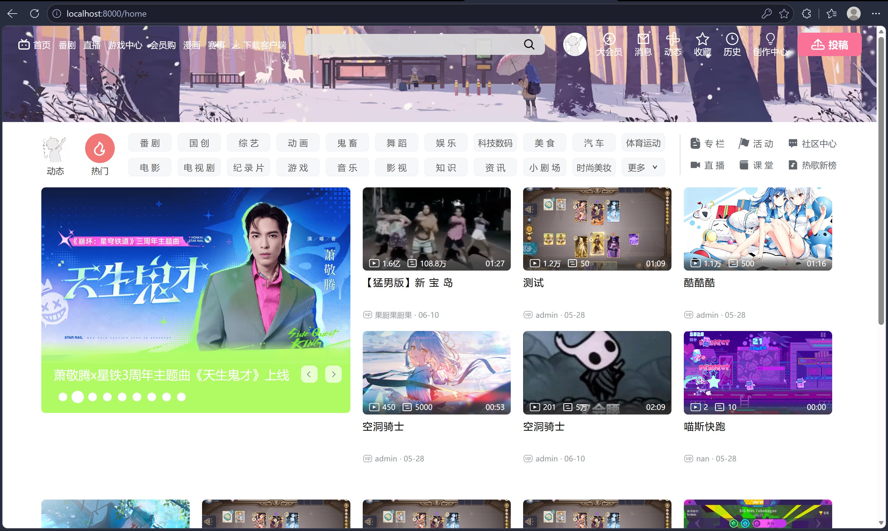
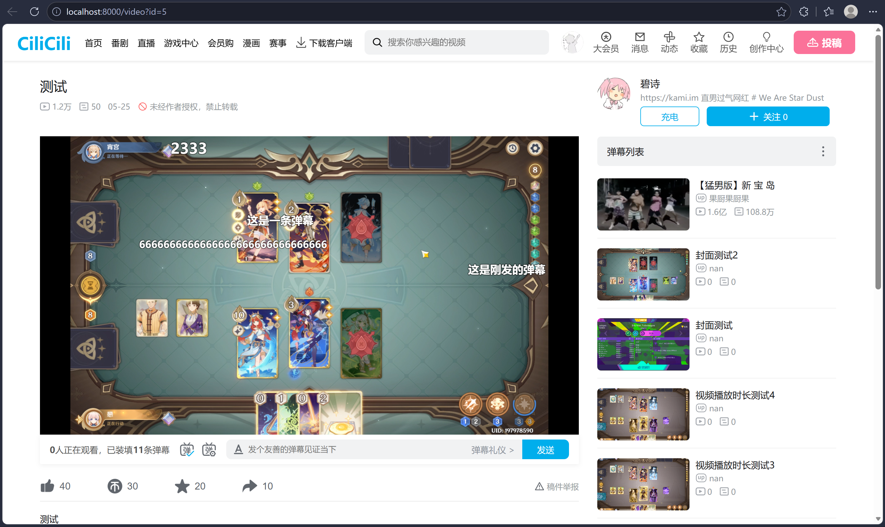
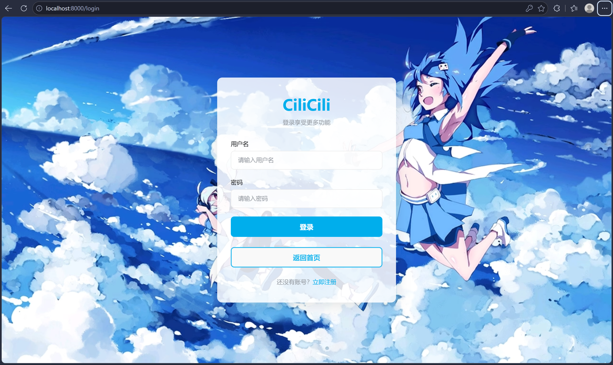
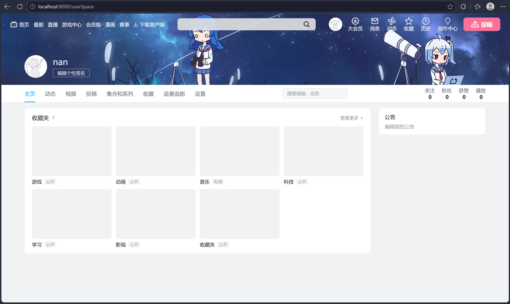
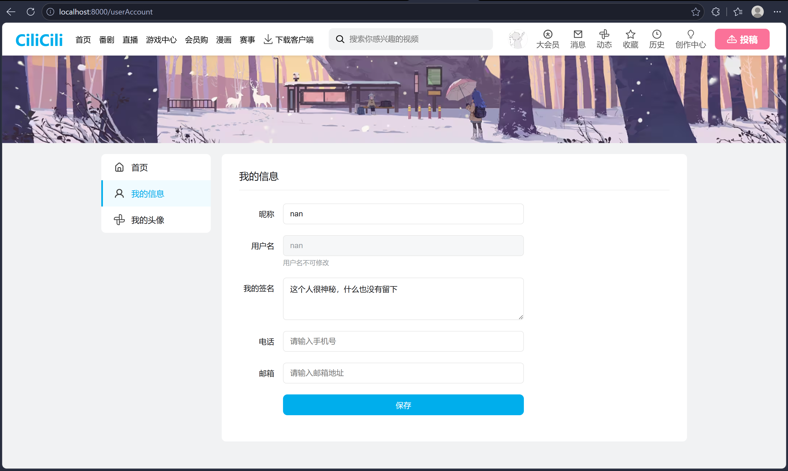

# 🎬 CiliCili — 仿哔哩哔哩视频弹幕平台

一个前后端分离的类 B 站视频分享与弹幕互动平台。（未完成）

***

## 📋 目录

- [项目简介](#-项目简介)
- [核心功能](#-核心功能)
- [版本信息](#-版本信息)
- [技术架构](#-技术架构)
- [整体结构](#-整体结构)
- [前端项目](#-前端项目-cilicili-front)
- [后端项目](#-后端项目-cilicili-back)
- [快速开始](#-快速开始)
- [API 接口](#-api-接口)
- [页面路由](#-页面路由)
- [组件一览](#-组件一览)
- [数据库配置](#-数据库配置)

***

## 📖 项目简介

CiliCili 是一个模仿 B 站（哔哩哔哩）的视频弹幕平台，实现视频浏览、播放、弹幕互动、用户管理、后台审核等核心功能。

- **前端**：Vue 3 + Vite + Element Plus，采用 CSS Grid 布局实现类 B 站 5 列视频卡片主页
- **后端**：Spring Boot + MyBatis-Plus + MySQL，提供 RESTful API 接口
- **弹幕**：Canvas 渲染引擎 + WebSocket（STOMP）实时推送
- **用户**：注册登录（JWT）、个人中心（信息编辑/头像上传）、个人空间
- **管理**：后台用户管理（封禁/解封）、视频审核（通过/驳回）、数据统计

***

## � 页面展示

| 首页  

| 视频播放页  

| 登录页  

| 个人空间  

| 个人中心  

***

## ✨ 核心功能

### 🎥 视频
- 视频上传（MP4，最大 500MB，含封面图上传）
- 视频帧截图取封面（Canvas 实时捕获视频帧）
- 流式播放（HTTP Range 支持拖拽进度条）
- 自定义 HTML5 播放器（播放/暂停、进度条、音量、倍速 0.5x~2x、全屏）
- 视频观看进度自动保存（sessionStorage + localStorage 跨会话恢复）
- 推荐视频（按播放量排序，分页加载）
- 相关视频推荐（侧边栏）

### 💬 弹幕
- Canvas 渲染引擎（12 条轨道池化分配，避免重叠）
- WebSocket（STOMP）实时弹幕推送
- 弹幕开关 + 显示区域调节
- 拖拽进度条时弹幕位置自动恢复（seek 恢复算法）
- 历史弹幕批量加载（按播放时间排序）
- 全屏模式下弹幕自适应缩放（1.5x）

### 👤 用户
- 注册/登录（JWT 认证 + BCrypt 密码加密）
- 个人中心（昵称/签名/邮箱/电话编辑）
- 头像上传（支持 JPG/PNG/GIF/WebP）
- 用户个人空间（B 站风格公开主页，含收藏夹展示）
- 头像悬浮菜单（快捷导航/退出登录）

### 🛠 后台管理
- 管理员登录（角色权限控制）
- 用户管理（查看列表、封禁/解封、删除、注销申请处理）
- 视频审核（待审核 → 通过/驳回/下架）
- 删除视频时自动清理文件

***

## 🏷 版本信息

| 模块                          | 说明                                     |
| --------------------------- | -------------------------------------- |
| **前端项目** (`cilicili-front`) | package.json → `0.2.0` / UI 迭代至 V0.3.8 |
| **后端项目** (`cilicili-back`)  | pom.xml 当前版本                           |
| Vue 3                       | Composition API + `<script setup>`     |
| Vite                        | 极速构建工具                                 |
| Pinia                       | 状态管理（Vuex 替代）                           |
| Vue Router                  | 前端路由（History 模式）                       |
| Element Plus                | UI 组件库                                 |
| Axios                       | HTTP 客户端                               |
| STOMP.js                    | WebSocket 客户端（弹幕实时推送）                   |
| Spring Boot                 | Java Web 框架                            |
| MyBatis-Plus                | ORM 框架                                 |
| MySQL Connector             | 数据库驱动                                  |
| Druid                       | 数据库连接池                                 |
| JWT                         | 用户认证                                   |
| Java                        | JDK 版本                                 |
| Lombok                      | 简化 Java 代码                             |

***

## 🏗 技术架构

```
┌─────────────────────────────────────────────────┐
│                    浏览器                        │
│          Vue 3 + Element Plus (SPA)              │
└────────────────┬────────────────────────────────┘
                 │  HTTP / Axios
                 ▼
┌─────────────────────────────────────────────────┐
│              Vite Dev Server :8000               │
│            (开发代理可转发至 :6060)              │
└─────────────────────────────────────────────────┘
                 │
                 ▼
┌─────────────────────────────────────────────────┐
│           Spring Boot :6060 (后端)               │
│   Controller → Service → Mapper → MySQL         │
│              cili_videodb 数据库                 │
└─────────────────────────────────────────────────┘
```

***

## 📁 整体结构

```
video-danmu web/
├── README.md                          # ← 你在这里
├── cilicili-front/                    # 前端项目
│   ├── package.json
│   ├── vite.config.js
│   ├── index.html
│   └── src/
│       ├── main.js                    # 应用入口
│       ├── App.vue                    # 根组件
│       ├── api/index.js               # 后端 API 封装
│       ├── router/index.js            # 路由配置
│       ├── stores/index.js            # Pinia 状态管理
│       ├── utils/
│       │   ├── request.js             # Axios 实例（JWT 注入）
│       │   ├── userStorage.js         # 用户数据 & Token 管理
│       │   ├── videoData.js           # 视频数据获取 & 格式化
│       │   └── useWebSocket.js        # STOMP WebSocket 封装
│       ├── components/                # 通用组件（16 个）
│       └── views/                     # 页面视图（8 个）
└── cilicili-back/                     # 后端项目
    ├── pom.xml
    └── src/main/
        ├── java/com/zsn/
        │   ├── CiliCiliApplication.java
        │   ├── controller/
        │   │   ├── UserController.java
        │   │   ├── VideoController.java
        │   │   ├── DanmakuController.java
        │   │   ├── AdminUserController.java
        │   │   └── AdminVideoController.java
        │   ├── service/
        │   ├── mapper/
        │   ├── entity/
        │   ├── config/
        │   │   ├── SecurityConfig.java
        │   │   ├── WebSocketConfig.java
        │   │   ├── WebConfig.java
        │   │   └── MybatisPlusConfig.java
        │   └── interceptor/
        │       └── JwtInterceptor.java
        └── resources/
            └── application.yml
```

***

## 🎨 前端项目 (cilicili-front)

### 启动

```bash
cd cilicili-front
npm install                # 安装依赖
npm run dev                # 开发模式 → http://localhost:8000
npm run pro                # 生产模式
npm run build              # 构建 → dist/
npm run serve              # 预览构建结果
```

### 技术栈表

| 技术           | 用途      |
| ------------ | ------- |
| Vue 3        | 前端框架    |
| Vite         | 构建工具    |
| Vue Router   | 路由      |
| Pinia        | 状态管理    |
| Element Plus | UI 组件   |
| Axios        | HTTP 请求 |

### 核心特性

- **CSS Grid 主页布局**：5 列视频卡片网格，轮播图跨 2 列 × 2 行
- **Canvas 弹幕引擎**：12 条轨道池化分配、滚动速度自适应文本长度、拖拽 seek 自动恢复位置、全屏 1.5x 缩放、DPR 高清渲染
- **WebSocket 实时推送**：STOMP 协议订阅弹幕频道，低延迟广播
- **自定义播放器**：进度条拖拽、倍速播放（0.5x~2x）、音量控制、全屏、观看进度自动保存
- **视频投稿**：封面图上传 + 视频帧截图取封面（Canvas 捕获）
- **用户中心**：个人信息编辑、头像上传预览、B 站风格个人空间主页
- **自动轮播**：`HomeMainCarousel` 支持自动播放、鼠标悬浮暂停、指示器切换
- **浮动导航栏**：页面下滚后浮现固定导航栏，含用户悬浮菜单
- **BEM 命名**：CSS 统一采用 BEM 规范（如 `.carousel__dot--active`）
- **4 格缩进**：全项目统一 4 格缩进风格
- **路由懒加载**：所有页面组件 `() => import(...)`
- **Axios 封装**：`request.js` 统一请求拦截与 JWT 注入、错误处理

***

## ☕ 后端项目 (cilicili-back)

### 启动

```bash
cd cilicili-back
# 1. 确保 MySQL 运行，创建数据库 cili_videodb
# 2. 修改 src/main/resources/application.yml 中的数据库连接信息
# 3. 使用 IDE（IDEA / Eclipse）导入 Maven 项目并运行
mvn spring-boot:run       # 或使用 Maven 命令
```

服务默认运行在 \*\*<http://localhost:6060**。>

### 技术栈表

| 技术              | 用途           |
| --------------- | ------------ |
| Spring Boot     | Web 框架       |
| MyBatis-Plus    | ORM          |
| MySQL Connector | 数据库驱动        |
| Druid           | 监控和管理的数据库连接池 |
| Java            | 运行环境         |
| Lombok          | 代码简化         |
| Maven           | 构建与依赖管理      |

### 项目分层

```
Controller (UserController)    ← 接收 HTTP 请求
    ↓
Service (UserServiceImpl)      ← 业务逻辑
    ↓
Mapper (UserMapper)            ← 数据库操作（MyBatis-Plus）
    ↓
Entity (User)                  ← 数据实体
```

- 启动类：[CiliCiliApplication.java](cilicili-back/src/main/java/com/zsn/CiliCiliApplication.java)
- Mapper 扫描路径：`com.zsn.mapper`（MyBatis-Plus 自动代理）
- 数据库：`cili_videodb` → 端口 `6060`

***

## 🚀 快速开始（完整流程）

### 环境要求

| 工具      | 最低版本 |
| ------- | ---- |
| Node.js | ≥ 16 |
| npm     | ≥ 8  |
| JDK     | 1.8  |
| Maven   | 3.6+ |
| MySQL   | 8.0  |

### 1.修改数据库连接信息

- 打开 `cilicili-back/src/main/resources/application.example.yml` 文件
- 找到 `spring.datasource.username` 和 `spring.datasource.password` 行
- 将 `your_db_username` 和 `your_db_password` 替换为你的 MySQL 用户名和密码
- 将 `application.example.yml` 重命名为 `application.yml`

### 2. 启动后端

```bash
# 创建数据库
mysql -u root -p -e "CREATE DATABASE IF NOT EXISTS cili_videodb DEFAULT CHARSET utf8mb4"

# 进入后端目录
cd cilicili-back

# 修改 application.yml 中的数据库用户名/密码

# 启动
mvn spring-boot:run
# 后端运行在 http://localhost:6060
```

### 3. 启动前端

```bash
cd cilicili-front
npm install
npm run dev
# 前端运行在 http://localhost:8000
```

### 4. 访问

打开浏览器访问 **<http://localhost:8000>**

***

## 🔌 API 接口

**用户模块**：

| 接口                           | 方法   | 认证   | 说明                |
| ---------------------------- | ---- | ---- | ----------------- |
| `/api/users/register`        | POST | 否    | 用户注册              |
| `/api/users/login`           | POST | 否    | 用户登录，返回 JWT       |
| `/api/users/currentUser`     | POST | 是    | 获取当前登录用户信息        |
| `/api/users/check`           | GET  | 是    | 校验 Token 有效性       |
| `/api/users/getById/{id}`    | POST | 否    | 通过 ID 获取用户信息       |
| `/api/users/update`          | POST | 是    | 更新用户信息（昵称/签名/邮箱/电话）|
| `/api/users/avatar`          | POST | 是    | 上传用户头像            |
| `/api/users/avatar/{filename}` | GET | 否    | 获取头像图片文件          |

**视频模块**：

| 接口                           | 方法   | 认证   | 说明                |
| ---------------------------- | ---- | ---- | ----------------- |
| `/api/videos/upload`         | POST | 是    | 上传视频（MP4，最大 500MB） |
| `/api/videos/{id}`           | GET  | 否    | 流式播放视频（支持 Range 拖拽）|
| `/api/videos/{id}/info`      | GET  | 否    | 获取视频元数据           |
| `/api/videos/{id}/cover`     | GET  | 否    | 获取视频封面图           |
| `/api/videos/recommend`       | GET  | 否    | 推荐视频列表（按播放量排序）    |
| `/api/videos/related`        | GET  | 否    | 相关视频列表（侧边栏推荐）     |

**弹幕模块**：

| 接口                           | 方法   | 认证   | 说明                |
| ---------------------------- | ---- | ---- | ----------------- |
| `/api/danmaku/send`          | POST | 是    | 发送弹幕（HTTP + WebSocket 广播）|
| `/api/danmaku/{videoId}`     | GET  | 否    | 获取视频全部弹幕（按播放时间排序） |
| WebSocket `/ws`              | —    | 否    | STOMP 实时弹幕推送      |

**管理后台**（需 admin 角色）：

| 接口                           | 方法     | 说明              |
| ---------------------------- | ------ | --------------- |
| `/api/admin/login`           | POST   | 管理员登录           |
| `/api/admin/users`           | GET    | 查看所有用户          |
| `/api/admin/users/{id}/status` | PUT  | 封禁/解封用户（状态管理）   |
| `/api/admin/users/{id}/delete-request` | PUT | 处理注销申请      |
| `/api/admin/users/{id}`      | DELETE | 删除用户            |
| `/api/admin/videos`          | GET    | 查看所有视频（可按状态筛选）  |
| `/api/admin/videos/{id}/status` | PUT  | 审核视频（通过/驳回/下架） |
| `/api/admin/videos/{id}`     | DELETE | 删除视频（含文件清理）     |

接口前缀 `/api` 由前端 Axios 实例 `baseURL` 统一配置。

***

## 🧭 页面路由

| 路径            | 页面          | 说明                  |
| ------------- | ----------- | ------------------- |
| `/`           | —           | 重定向到 `/home`        |
| `/home`       | Home        | 主页：轮播图 + 视频卡片网格     |
| `/video`      | VideoPage   | 视频播放详情页（弹幕 + 左右布局）  |
| `/login`      | Login       | 用户登录页               |
| `/register`   | Register    | 用户注册页               |
| `/upload`     | Upload      | 视频投稿上传页（需登录）        |
| `/userSpace`  | UserSpace   | 用户个人空间（公开主页）        |
| `/userAccount` | UserAccount | 个人中心（信息编辑/头像上传）     |
| `/test`       | Test        | Token 调试页（需登录）       |

***

## 🧩 前端组件

| 组件                     | 层级   | 职责                        |
| ---------------------- | ---- | ------------------------- |
| `FloatBanner`          | 全局   | 滚动浮现的固定导航栏（含用户菜单、投稿入口）   |
| `HomeHeaderBanner`     | 主页   | 顶部半透明导航：Logo、搜索框、用户操作      |
| `HomeCenterBanner`     | 主页   | 二级导航：22 个分类标签、快捷入口         |
| `HomeMain`             | 主页   | 5 列 Grid 容器 + 推荐视频列表        |
| `HomeMainCarousel`     | 主页   | 轮播图（跨 2×2 网格，自动播放/悬浮暂停）    |
| `VideoCard`            | 通用   | 可复用视频卡片（封面/标题/UP主/播放量）     |
| `VideoPageLeft`        | 播放页  | 视频播放区 + 弹幕控制栏 + 视频信息 + 评论区  |
| `VideoPageRight`       | 播放页  | UP主信息卡 + 右侧推荐视频列表          |
| `DanmakuOverlay`       | 播放页  | Canvas 弹幕渲染引擎（12 轨道池化分配）   |
| `VideoPage_CustomPlayer` | 播放页 | 自定义 HTML5 播放器（进度保存/倍速/全屏） |
| `Videopagecomment`     | 播放页  | 评论区组件                     |
| `UserMenuPopover`      | 全局   | 头像悬浮菜单（个人中心/退出登录）         |
| `SelectVideoCover`     | 上传页  | 视频帧截图取封面（Canvas 捕获帧）       |
| `LoginBgCarousel`      | 登录页  | 登录/注册页全屏背景轮播              |
| `Copyright`            | 全局   | 页脚版权信息                    |

***

## 🗄 数据库配置

```yaml
# cilicili-back/src/main/resources/application.yml
server:
  port: 6060

spring:
  datasource:
    url: jdbc:mysql://localhost:3306/cili_videodb
    driver-class-name: com.mysql.cj.jdbc.Driver
    username: your_db_username
    password: your_db_password

mybatis-plus:
  configuration:
    map-underscore-to-camel-case: true
  global-config:
    db-config:
      id-type: auto
......
```

> ⚠️ 部署前请修改 `username` 和 `password` 为你自己的 MySQL 凭据。

***

## ⚙️ 配置要点

- **跨域**：如需开发代理，在 `cilicili-front/vite.config.js` 中配置 `server.proxy`
- **端口**：前端 `:8000`，后端 `:6060`
- **路径别名**：前端 `@` → `src/`
- **CSS 规范**：BEM 命名 + 4 格缩进

***


## �📝 变更日志

| 日期         | 版本     | 变更内容                                                  |
| ---------- | ------ | ----------------------------------------------------- |
| 2026-05-10 | V0.3.8 | 个人中心（信息编辑/头像上传）、用户个人空间、后台管理（用户管理/视频审核）    |
| 2026-05-09 | V0.3.5 | Canvas 弹幕引擎重构（轨道池化/seek 恢复/全屏缩放）、WebSocket 实时推送 |
| 2026-05-09 | V0.3.2 | 主页 Grid 布局重构、轮播图跨 2×2 网格、浮动标题栏修复、ARIA 可访问性增强、缩进统一 4 格 |
| —          | V0.3.0 | Axios 封装 request.js、标题/icon 替换、视频上传页               |
| —          | V0.2.0 | Element Plus 集成、登录页完善、FloatBanner 重构                  |
| —          | V0.1.0 | 项目初始化：Vue 3 + Vite + Spring Boot 基础模板                 |

